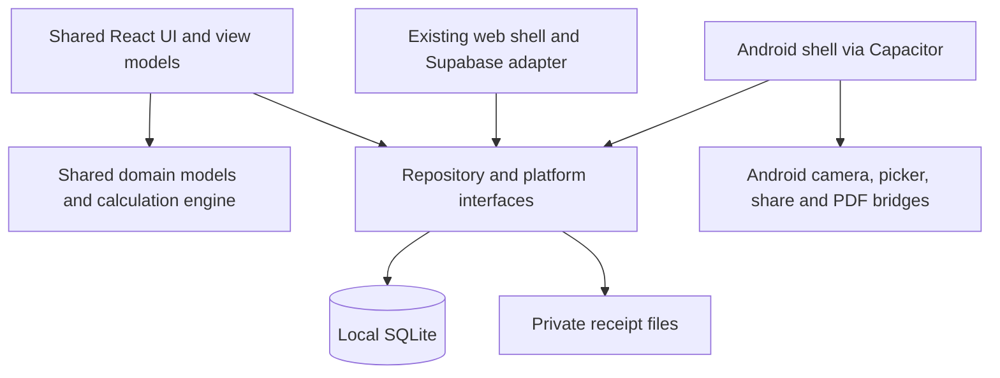

# Android Solo Admin Edition — Product Requirements Document

**Document version:** 1.0

**Status:** Approved for implementation planning

**Product version target:** New Android product line; initial version to be assigned at the Phase A release gate

**Applies to:** Android Solo Admin Edition only

## 1. Purpose and precedence

This document defines a new, phone-first edition of Group Expense Sharing for a single administrator. All event data is held locally on that administrator's Android device. Participants do not connect to the administrator's database and do not need an account.

For this edition, this PRD supersedes cloud, multi-device, participant-link, and shared-administration assumptions in the original PRD and engineering plan. It does not replace or alter the existing deployed web edition. The approved calculation rules remain the product baseline unless this document explicitly changes them.

## 2. Product vision

The administrator receives expense information from participants, primarily through WhatsApp, records or imports it into one private Android application, verifies the information, and produces an explainable final report showing:

- each family's expenses and proportional share;
- how every amount was calculated;
- each family's final balance;
- the minimum practical set of payments required to settle the event.

The product should feel like a native phone application, work without a network connection, preserve data safely between upgrades, and be capable of later Google Play distribution without a rewrite.

## 3. Users and trust model

### Primary user

One trusted event administrator who owns the phone, creates events, maintains families and members, enters or confirms every expense, runs calculations, and exports reports.

### Participants

Participants are information sources, not application users in Phase A. They send text and receipt images to the administrator outside the application. In Phase B they may use a lightweight reporting aid, but no participant can write directly into the authoritative local database.

### Trust boundary

- The Android application and its private local storage are authoritative.
- Imported or shared content is always an untrusted draft until the administrator confirms it.
- A WhatsApp share does not reliably identify the sender; the administrator must select or confirm the reporter.
- The reporter's family is derived from the selected member's family relationship and is not independently guessed.

## 4. Product principles

1. **Local first:** core operation requires no server and no Supabase connection.
2. **One authority:** only the administrator commits changes to event data.
3. **Explainable calculations:** every result can be traced to members, weights, expenses, and rounding rules.
4. **Safe suggestions:** OCR and imported fields assist entry but never silently become authoritative.
5. **Portable ownership:** the administrator can back up, restore, and export their own data.
6. **Reuse proven logic:** preserve the existing React/TypeScript calculation engine and tested business rules.
7. **Future distribution without redesign:** use a stable Android identity, migrations, and signing strategy from Phase A.

## 5. Scope by phase

## Phase A — Local Android application

### Goal

Deliver a privately installable Android APK that replaces the shared database with local storage while retaining the core event-management, calculation, reporting, and dashboard capabilities.

### Required capabilities

#### Application shell

- Package the existing React/TypeScript application in a native Android shell using Capacitor.
- Provide an administrator-only navigation model; remove manager-code and participant-access flows from this edition.
- Run fully offline after installation.
- Use a stable Android application ID and a stable signing key so future upgrades preserve installed data.

#### Local data

- Store structured data in an on-device SQLite database located in application-private storage.
- Store receipt files in application-private file storage and retain only file metadata and paths in SQLite.
- Version the database schema and apply forward-only migrations during application upgrades.
- Preserve stable IDs and timestamps for families, members, events, attendance, expenses, receipts, and calculation snapshots.
- Never store receipt images as base64 strings inside the database.

#### Event management

- Create, edit, archive, and reopen events.
- Create and edit families and members.
- Associate each member with exactly one family for an event.
- Configure participation and calculation weight per member.
- Resolve weight in this order: explicitly entered weight, then birth-date rule, then default weight.
- Show the source and resolved value used in the final calculation report.

#### Expense entry

- Enter an expense manually with title, amount, note, date, reporter, and optional receipt.
- Select the reporter from the event's members; derive and display the family automatically.
- Edit all expense fields after creation, including replacing or adding a receipt.
- Delete an expense only after explicit confirmation.
- Filter and sort expenses by family, reporter, date, and amount.

#### Receipts

- Add a receipt from the camera, Android photo picker, or file picker.
- Copy the selected receipt into application-private storage before saving the expense.
- Preview, replace, share, or remove a receipt.
- Report missing or unreadable files without losing the expense record.

#### Calculation and reports

- Reuse the approved calculation engine and rounding/settlement rules.
- Show the detailed calculation report, family summary, balances, and who-pays-whom settlement.
- Preserve the dashboard views, including a pie/donut visualization per family and a table for reporters.
- Export the detailed report and the dashboard summary as readable PDF documents on a real Android device.
- Share exported PDF files through the Android Sharesheet.

#### Backup, restore, and migration

- Export one portable backup package containing versioned JSON data, receipt files, and an integrity manifest.
- Restore a backup only after validation and an explicit replace/merge choice; create a safety backup before replacement.
- Clearly warn that a backup package can contain personal information and receipt images and is not automatically uploaded anywhere.
- Support a one-time import package from the existing web edition so current families, members, events, expenses, and receipts can move without modifying or deleting the existing Supabase data.
- Preserve original identifiers where possible and produce an import summary with imported, skipped, and failed records.

### Out of scope for Phase A

- Google Play publication.
- Participant accounts or a participant-facing client.
- Direct network connection to the administrator's phone.
- Cloud synchronization, realtime updates, or shared database access.
- Automatic reading of WhatsApp messages or sender identity.
- Automatic acceptance of OCR results.

## Phase B — Reporting upgrade

### Goal

Reduce the administrator's manual work while keeping the local database private and administrator-controlled.

### B1: Android sharing intake

- Register the application as an Android Share Target for text, one image, or text plus image when supported by the source application.
- Accept shared content from WhatsApp and other Android applications through standard Android intents.
- Create a local draft rather than a saved expense.
- Copy shared files into a temporary private inbox and clean abandoned drafts according to a documented retention policy.
- Suggest title and amount from shared text and optional on-device OCR.
- Require the administrator to select or confirm the reporter; derive the family from that selection.
- Show the original shared text and receipt next to suggested fields.
- Allow Save or Discard; never commit automatically.
- Warn about likely duplicates using file hash, amount, reporter, and time proximity without blocking a legitimate save.

### B2: Optional structured participant report

After B1 is stable, evaluate a small stateless participant form that creates a structured report package which can be sent through WhatsApp. The package may include event, reporter, amount, title, note, and receipt. It must not require a shared operational database, must be schema-validated on import, and must still require administrator confirmation.

B2 is not required for completion of B1 and needs a separate product decision after real-world use.

## Phase C — Google Play distribution

### Goal

Publish the stable local Android application through Google Play while preserving local data and the no-shared-database model.

### Required capabilities and release work

- Produce a signed Android App Bundle (AAB) using the stable application ID established in Phase A.
- Configure Play App Signing and securely preserve the upload key outside the repository.
- Verify the then-current Android target SDK and Google Play policy requirements before submission.
- Provide store listing assets, support contact, privacy policy, and accurate Data safety declarations.
- Demonstrate that app updates migrate the local database without data loss.
- Validate backup/restore across an uninstall or device change before production rollout.
- Complete internal testing, closed testing if required, staged production rollout, and rollback monitoring.
- Ensure analytics, crash reporting, or network services are not added silently; each requires a privacy review and explicit decision.

## 6. Target architecture

The existing web product remains a separate composition using its current cloud adapter. The Android edition composes the same domain and calculation code with local repositories and native platform services. UI code may be shared where it fits, but web-only authentication, realtime, and participant routing must not leak into the Android runtime.

## 7. Core data rules

- Money is represented in integer minor units internally; formatting happens only at display/export boundaries.
- An expense has one reporter and the reporter has one family association in the event.
- A receipt is optional and must not determine whether an expense participates in calculation.
- Manual member weight, including `0` and fractional values such as `0.5`, is a valid explicit value and must not be replaced by truthy/falsy fallback logic.
- Every calculation snapshot records inputs, algorithm version, output, and timestamp so a report can be reproduced.
- Import and restore operations are idempotent by stable record ID where feasible.

## 8. Security and privacy

- Rely on Android application-private storage for the live database and receipt files.
- Do not embed credentials, Supabase keys, service secrets, or signing keys in the application package or repository.
- Use Android URI permissions and content providers for temporary external file access; do not expose raw private paths.
- Remove temporary shared files after save/discard or expiry.
- Protect destructive actions with confirmation and preserve a recoverable backup before bulk replacement.
- The application must disclose that exported backups and reports may contain personal and financial information.
- Biometric/PIN application lock and encrypted export are desirable follow-up features, not Phase A release blockers unless the threat model changes.

## 9. Non-functional requirements

- **Offline:** all core CRUD, calculation, dashboard, report, backup, and restore operations work without network access.
- **Reliability:** an interrupted save or import must not leave partially committed structured data.
- **Performance:** typical events with hundreds of expenses and receipt thumbnails remain responsive on a mid-range supported Android device.
- **Accessibility:** controls have labels, sufficient contrast, touch targets, and RTL support.
- **Localization:** Hebrew/RTL remains first-class; English remains supported where the current product supports it.
- **Compatibility:** minimum and target Android versions are selected and recorded in an ADR during Sprint A0.
- **Testability:** business logic remains framework-independent and repository/platform boundaries can be tested with fakes.
- **Observability:** errors are visible to the administrator with actionable recovery guidance; no sensitive content is written to production logs.

## 10. Acceptance criteria

### Phase A release gate

- A signed release APK installs and upgrades on a physical Android device.
- The app launches and completes all core workflows in airplane mode.
- A complete sample event can be created, calculated, closed, exported, backed up, deleted from a test installation, and restored with identical totals and receipts.
- Existing web data can be exported and imported without modifying the source data.
- Calculation regression tests match the current approved web results, including explicit weights of `0` and `0.5`.
- PDF outputs are visually inspected on-device for Hebrew legibility, clipping, page breaks, charts, tables, and settlement summary.
- The existing deployed web application remains operational and unchanged.

### Phase B release gate

- Sharing text and receipt images from WhatsApp into the app creates a draft.
- No draft is saved without administrator confirmation of reporter and fields.
- Sender identity is never inferred from WhatsApp metadata.
- Duplicate warnings, discard cleanup, and unsupported-content errors are tested on a physical device.

### Phase C release gate

- A Play-delivered update preserves database, receipt files, settings, and calculation results.
- Store policy, privacy, signing, testing-track, and production-readiness checks are complete.
- Backup and restore are verified on a second physical device or clean installation.

## 11. Product decisions deferred to implementation gates

- Final product name, icon, Android application ID, and supported Android minimum version: Sprint A0.
- SQLite and Capacitor plugin selections: Sprint A0 technical spike and ADR.
- On-device OCR engine: selected in Phase B only after accuracy, Hebrew support, package size, and privacy evaluation.
- Encrypted backup package: reassess before broader distribution in Phase C.
- B2 participant reporting aid: decide after B1 usage feedback.

## 12. Reference standards

- [Capacitor documentation](https://capacitorjs.com/docs)
- [Android Sharesheet and sending simple data](https://developer.android.com/training/sharing/send)
- [Android secure file sharing](https://developer.android.com/training/secure-file-sharing)
- [Android App Bundles](https://developer.android.com/guide/app-bundle)
